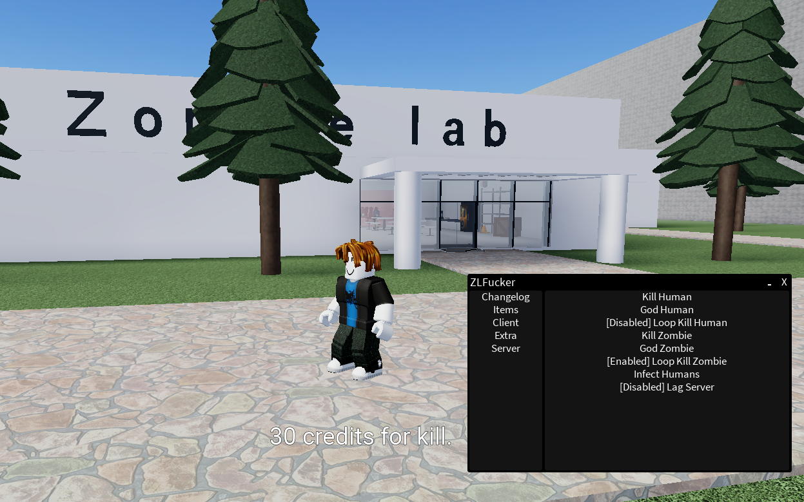

# ZLFucker
A roblox script made to showcase vulnerabilities inside poorly created zombie laboratory games. 
</img>

### Supported/Planned Games:
* ✅ [Zombie Lab](<https://www.roblox.com/games/6741970382/Zombie-lab-Optimization-Update>) by [@sulkang](<https://www.roblox.com/users/1031487406/profile/>)
* ✅ [Zombie game](<https://www.roblox.com/games/14419907512/Zombie-game-upd3>) by [@I make random games](<https://www.roblox.com/communities/32925160/I-make-random-games/>)

Join our [discord](https://discord.gg/wDGZwDD8EX) to request support for a game.

The last documentation update for the scripts was <time datetime="2025-05-06"><b>Tuesday, May 6, 2025</b></time>, you may request a documentation update through github's issue tab.
