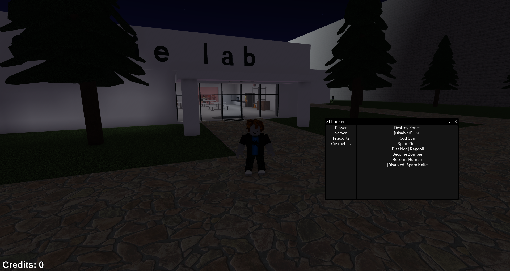

# ZLFucker
A roblox script made to showcase vulnerabilities inside poorly created games.

</img>
</img>
### Supported/Planned Games:
* ✅ [Zombie lab](<https://www.roblox.com/games/6741970382/Zombie-lab-Optimization-Update>) by [@sulkang](<https://www.roblox.com/users/1031487406/profile/>)
* ✅ [Zombie game](<https://www.roblox.com/games/14419907512/Zombie-game-upd3>) by [@IkimasuSaru](<https://www.roblox.com/users/5386185136/profile>)
* ✅ [untitled zombie gaem](<https://www.roblox.com/games/4836068080/untitled-zombie-gaem>) by [Ziudo](<https://www.roblox.com/users/320980558/profile>)
* 🟨 [City of Ottwaw](<https://www.roblox.com/games/2631794742/City-of-Ottawa-NEW-UPDATE>) by [Sync_RBLX](<https://www.roblox.com/users/95425729/profile>)

Join our [discord](https://discord.gg/wDGZwDD8EX) to request support for a game.

The last documentation update for the scripts was <time datetime="2025-05-06"><b>Tuesday, May 6, 2025</b></time>, you may request a documentation update through github's issue tab.

